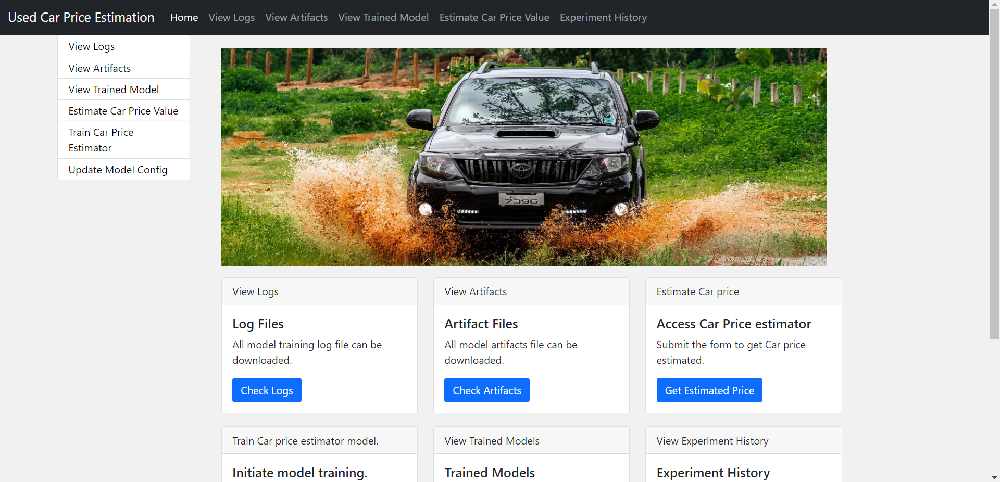
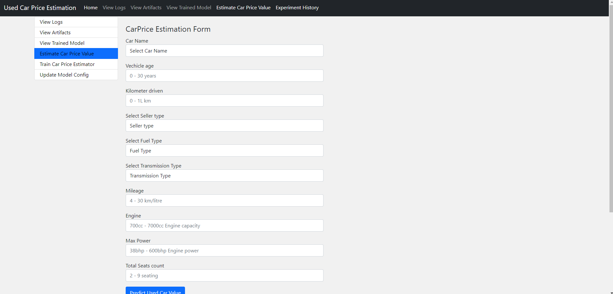
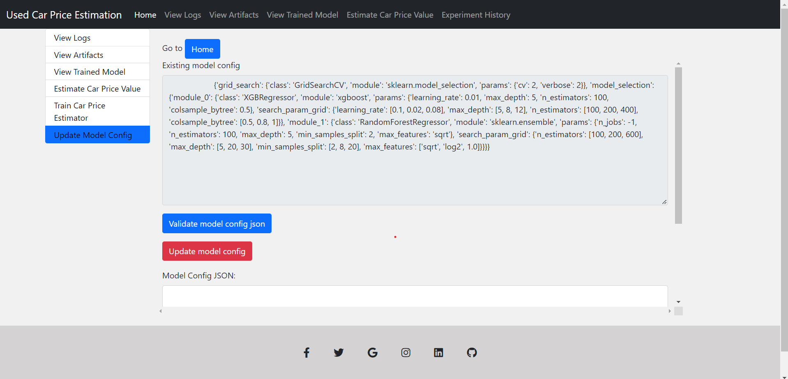

# 🚗 Used Car Price Prediction
This project aims to solve the problem of predicting the price of a used car, using Sklearn's supervised machine learning techniques. It is a regression problem and predictions are carried out on dataset of used car sales in the Indian car market Cardheko website. Several regression techniques have been studied, including XGboost and Random forests of decision trees.

Their performances were compared in order to determine which one works best with out dataset and used them to predict the price of a used car from user input from Flask application.

💿 Installing
1. Environment setup.
```
conda create --prefix venv python=3.9 -y
```
```
conda activate venv/
````
2. Install Requirements and setup
```
pip install -r requirements.txt
```
5. Run Application
```
Flask
```

🔧 Built with
- Flask
- Python 3.9
- Machine learning
- 🏦 Industrial Use Cases

## Models Used
* Linear Regression
* Lasso Regression
* Ridge Regression
* K-Neighbors Regressor
* Decision Tree
* Random Forest Regressor
* XGBRegressor
* CatBoosting Regressor
* AdaBoost Regressor

From these above models after hyperparameter optimization we selected Top two models which were XGBRegressor and Random Forest Regressors and used the following in Pipeline.

* GridSearchCV is used for Hyperparameter Optimization in the pipeline.

* Any modification has to be done in  Inside Config.yaml which can be done in route **/update_model_config**

## `carprice` is the main package folder which contains 

**Artifact** : Stores all artifacts created from running the application

**Components** : Contains all components of Machine Learning Project
- DataIngestion
- DataValidation
- DataTransformations
- ModelTrainer
- ModelEvaluation
- ModelPusher

**Custom Logger and Exceptions** are used in the Project for better debugging purposes.

## Application Screenshots
### **This is the screenshot of the final Webpage which was done using the Flask**


### **This is the screenshot of the webpage which gets user input for prediction**



### **This is the screenshot of the page in which user can change the model parameters for the experiment**


## Conclusion
- This Project can be used in real-life by Users or Used car dealers to predict the Estimated Price of the car based on input specifications.